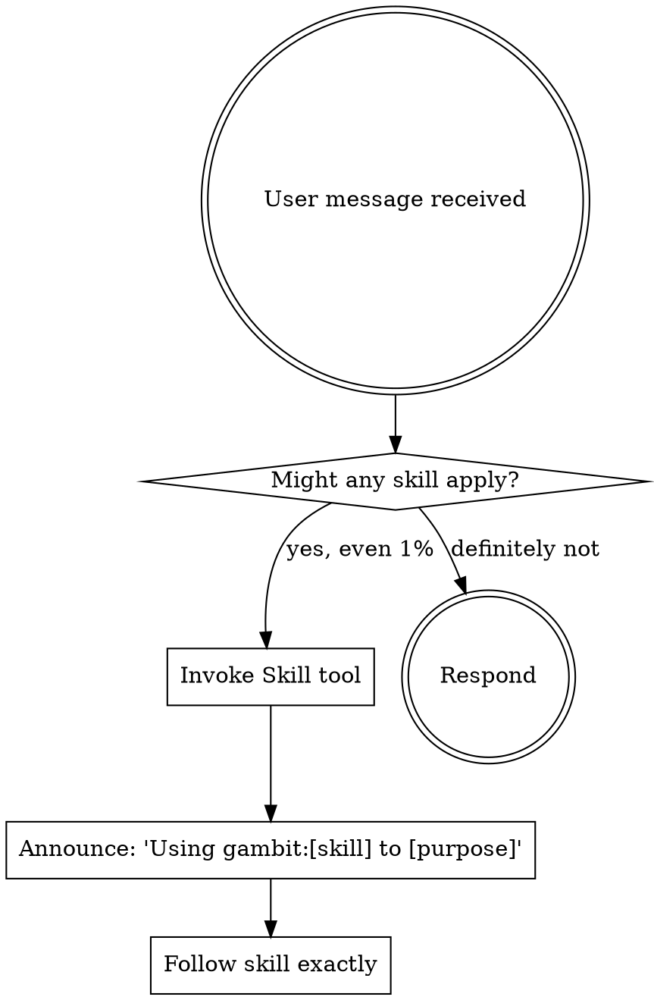

<EXTREMELY-IMPORTANT>
If you think there is even a 1% chance a skill might apply to what you are doing, you ABSOLUTELY MUST invoke the skill using the Skill tool.

IF A SKILL APPLIES TO YOUR TASK, YOU DO NOT HAVE A CHOICE. YOU MUST USE IT.

This is not negotiable. This is not optional. You cannot rationalize your way out of this.
</EXTREMELY-IMPORTANT>

# Using Gambit

Gambit provides structured development workflows using native Claude Code Tasks. This skill loads at session start and routes work to the correct skill.

**Invoke relevant skills BEFORE any response or action.** Even a 1% chance a skill might apply means you invoke the skill to check. If it turns out to be wrong, you don't need to follow it.

## Rigidity Level

LOW FREEDOM — Always check for relevant skills before acting. Never skip the check. No exceptions.

## How to Access Skills

Use the `Skill` tool. When you invoke a skill, its content is loaded — follow it directly. Never use the Read tool on skill files.

## Quick Reference

| Task Type | Skill | Slash Command |
|-----------|-------|---------------|
| New feature idea | brainstorming | `/gambit:brainstorming` |
| Create task plan | writing-plans | `/gambit:writing-plans` |
| Execute tasks | executing-plans | `/gambit:executing-plans` |
| Fix a bug | debugging | `/gambit:debugging` |
| Implement with TDD | test-driven-development | `/gambit:test-driven-development` |
| Improve code structure | refactoring | `/gambit:refactoring` |
| Review code | code-review | `/gambit:code-review` |
| Audit test quality | testing-quality | `/gambit:testing-quality` |
| Refine task details | task-refinement | `/gambit:task-refinement` |
| Verify completion | verification | `/gambit:verification` |
| Parallel investigations | parallel-agents | `/gambit:parallel-agents` |
| Create/modify skills | writing-skills | `/gambit:writing-skills` |
| Start feature branch | using-worktrees | `/gambit:using-worktrees` |
| Finish feature branch | finishing-branch | `/gambit:finishing-branch` |

## The Rule



## Skill Selection Guide

**User describes a new idea or feature (fork — pick ONE path):**

```
├─ Idea is vague or evolving → gambit:brainstorming
│  Creates epic + first task via Socratic questioning.
│  Brainstorming will ask: worktree? refine tasks? → then routes to executing-plans.
│
└─ Requirements already clear → gambit:writing-plans
   Creates epic + ALL subtasks with dependencies upfront.
   Writing-plans will ask: worktree? refine tasks? → then routes to executing-plans.
```

**After either path, the flow continues automatically:**
```
executing-plans (one task → checkpoint → STOP → repeat)
    ↓ all tasks done
finishing-branch (verify → merge/PR/keep/discard)
```

**Skill Priority — when multiple skills could apply:**

1. **Process skills first** (brainstorming, debugging) — these determine HOW to approach the task
2. **Implementation skills second** (TDD, refactoring) — these guide execution
3. **Verification skills last** (verification, testing-quality) — these confirm results

"Let's build X" → brainstorming first, then TDD.
"Fix this bug" → debugging first, then TDD for the fix.
"I think it's done" → verification before claiming complete.

## Red Flags

These thoughts mean STOP — you're rationalizing:

| Thought | Reality |
|---------|---------|
| "This is just a simple question" | Questions are tasks. Check for skills. |
| "I need more context first" | Skill check comes BEFORE clarifying questions. |
| "Let me explore the codebase first" | Skills tell you HOW to explore. Check first. |
| "This doesn't need a formal skill" | If a skill exists for it, use it. No exceptions. |
| "I remember this skill" | Skills evolve. Invoke the current version. |
| "This doesn't count as a task" | Action = task. Check for skills. |
| "The skill is overkill for this" | Simple things become complex. Use it. |
| "I'll just do this one thing first" | Check BEFORE doing anything. |
| "This is almost done, no need" | If you haven't verified, you're not done. |
| "Too simple for Tasks" | Simple tasks finish fast. Track them anyway. |
| "I know the pattern already" | Load the skill. Memory drifts, skills don't. |
| "Let me just fix this quickly" | Create a Task, follow the process. |
| "This feels productive" | Undisciplined action wastes time. Skills prevent this. |

## Core Principles

These apply across ALL gambit skills:

1. **One task then stop** — Execute one Task, present checkpoint, STOP for human review
2. **Tasks are source of truth** — Use `TaskCreate`, `TaskUpdate`, `TaskList`, `TaskGet`. Never track work mentally
3. **Evidence over assertions** — Run verification commands and show output before claiming done
4. **Small steps that stay green** — Tests pass between every change
5. **Immutable requirements** — Epic requirements don't change; Tasks adapt to reality

## User Instructions

Instructions say WHAT, not HOW. "Add X" or "Fix Y" doesn't mean skip workflows. The user telling you to do something does NOT exempt you from checking for skills first.

## Integration

**Loaded by:** Session start hook (automatic)

**Calls:** All other gambit skills based on task context

**Task tools used:**
- `TaskCreate` — Create tasks with subject, description, activeForm
- `TaskUpdate` — Set status (in_progress/completed), add blockers via `addBlockedBy`
- `TaskList` — Find ready tasks (status=pending, blockedBy=[])
- `TaskGet` — Read full task details and success criteria
